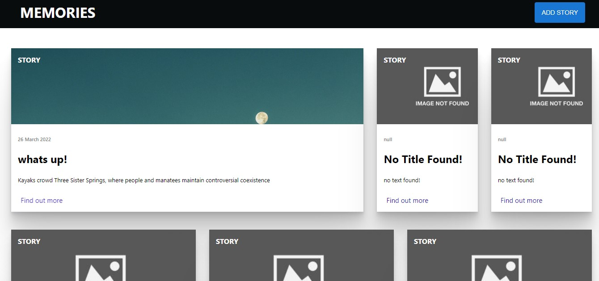
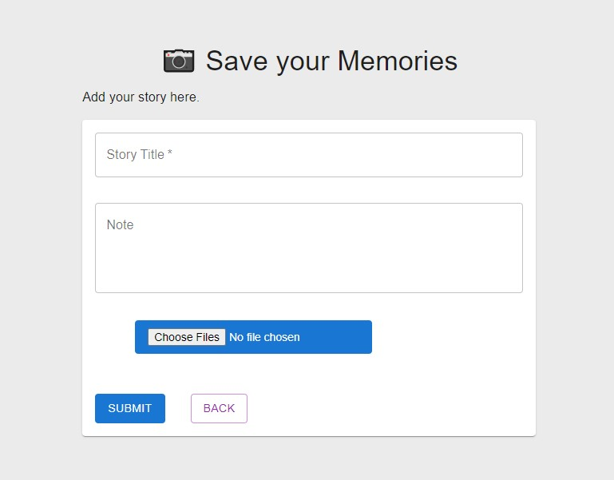
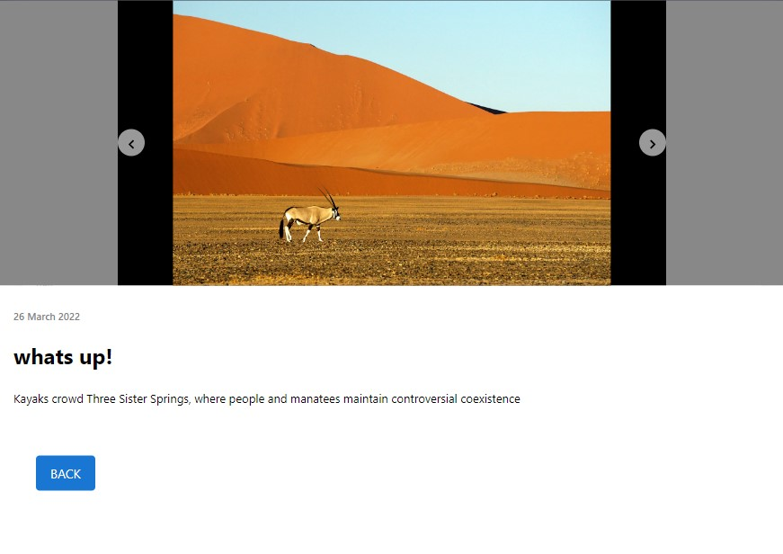

# Memories

Building a react app helps you save your memories (stories)

## Description

This project is in work. 

* Material UI (used)
* Redux (pending,  props drilling is used yet)
* Backend (pending, will use mongo & node)

## Overview

Displaying all saved stories on the home screen

Add a new story

View your stories

## License

This project is licensed under the [MIT] License - see the LICENSE.md file for details
