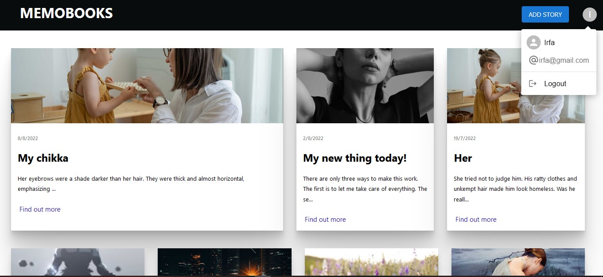
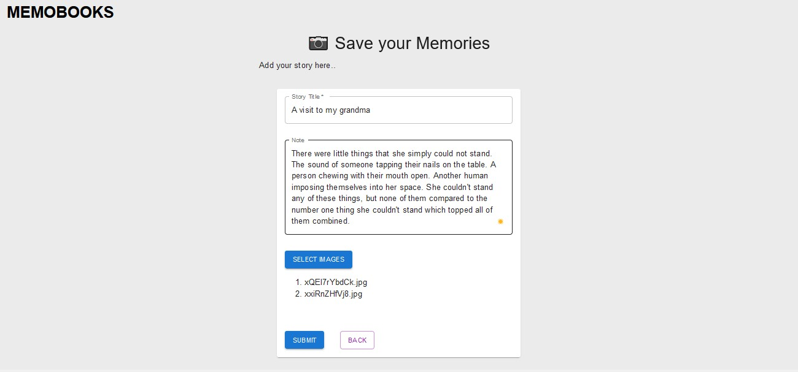
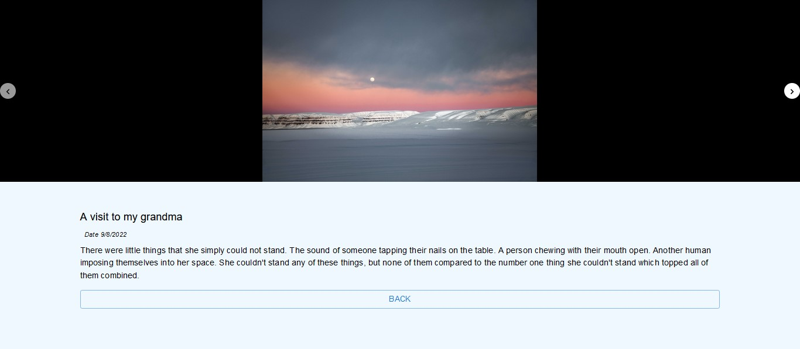
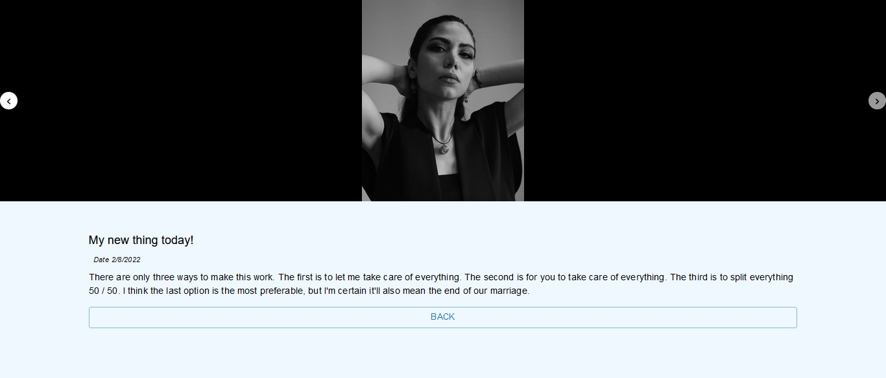
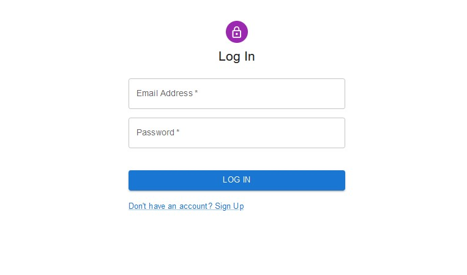
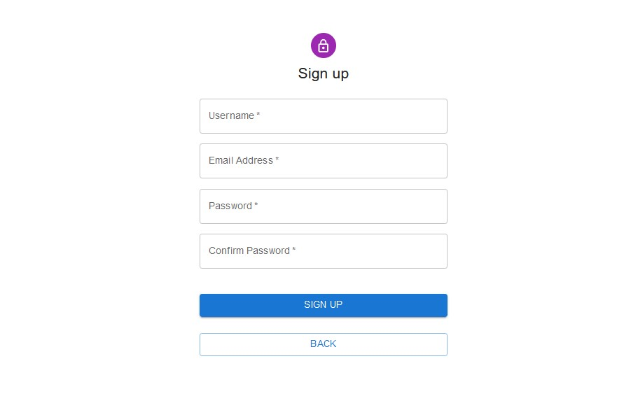

# Memobooks

Building a MERN app that helps you save your memories (stories).

You can **take a look** at the [https://memobooks.herokuapp.com/](https://memobooks.herokuapp.com/)

## Description

Tools used build the project are listed here.

* Material UI & SCSS.
* Backend (Node, Express, Mongodb, Firebase, Multer).
* Heroku for Deployment
* Firebase is used as middleware for uploading images.
* Viewport image rendering applied.

## Overview

Home UI showing all uploaded stories

Displaying all saved stories on the home screen

Add a new story

View your stories

Authentication Pages

## License

This project is licensed under the [MIT] License - see the LICENSE.md file for details
